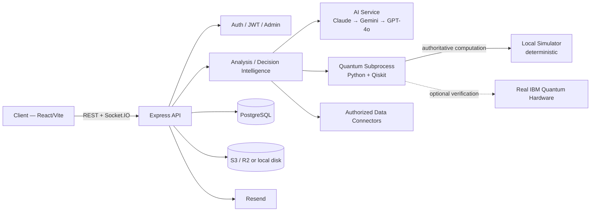

# ANATOLIA-Q

 

**Quantum-Based National Decision Support System**  
Bold Askeri Teknoloji ve Savunma Sanayi A.Ş.

ANATOLIA-Q generates structured decision-support reports across 10 domains, combining a multi-provider AI layer with deterministic quantum analysis and optional real IBM Quantum hardware verification. The platform is designed so users receive one clear decision-support result while provenance, auditability, verification, and institutional integration remain managed by the system.

---

## Research Context

This project sits at the intersection of applied AI and near-term quantum computing.

- **AI layer:** Claude (Anthropic) → Gemini → GPT-4o automatic fallback for report generation and consultation workflows.
- **Quantum layer:** scenario probability analysis, QAOA-based resource allocation, and quantum-kernel fraud/AML anomaly detection.
- **Deterministic decision path:** reported decisions come from the deterministic local computation path. Real IBM Quantum hardware, when configured, is used as an independent verification lane so NISQ hardware noise cannot alter the authoritative result.
- **Live IBM Quantum validation:** authentication, Qiskit Runtime service connection, real-backend selection, transpilation, hardware job submission, and result retrieval have been exercised against a real IBM Quantum Platform account through the production integration path.
- **Institutional integration:** the current deployment is not connected to any live bank, telecom, or government system. The data-source layer is intentionally pluggable: authorized institutional APIs, core-banking feeds, BDDK/BTK exports, or other structured sources can be normalized into the existing analysis pipeline without redesigning the core system.
- **Limitations:** successful IBM hardware verification proves that the circuit ran on real hardware; it does not by itself establish that the underlying input data came from an authoritative institutional source.

---

## Features

### AI & Reporting

- **10 Analysis Categories** — Defense, Energy, Offensive, Economy, Social, Consultation, Health, Multi-Domain Synthesis, BDDK, BTK
- **Triple AI Assurance** — Claude → Gemini → GPT-4o fallback
- **Fixed-Format Reports** — DOCX/PDF generation, report history, and central-mail delivery
- **Voice Assistant** — transcription, TTS, and natural-language command handling
- **Conversation Memory** — per-user consultation memory and archive
- **Morning Brief** — automated intelligence digest from configured public sources

### Decision Intelligence & Auditability

- **Analysis Orchestrator** — central execution primitives for ingest, validation, normalization, AI/quantum stages, and future institutional connector flows
- **Data Provenance** — records whether analysis input originated from model-generated data, user uploads, manual input, or an authorized institutional source
- **Data Quality Assessment** — assigns an internal quality level and score from available source/record/warning evidence
- **Evidence Chain** — preserves the principal AI, quantum, fraud, optimizer, and source metadata supporting an analysis
- **Decision Trace** — records the analysis execution path and stage timing without requiring the end user to manage internal engines
- **Model Registry** — records the AI provider/model and prompt version associated with analysis execution
- **Scenario Replay & Outcome Tracking** — platform APIs support replaying a recorded decision context and recording subsequent real-world outcomes
- **Analysis Audit View** — archived reports expose a concise audit panel showing provider/model, prompt version, source provenance, data quality, classification, duration, quantum backend metadata, and creation time when those fields are available

These controls are system-level traceability features. Users are not expected to compare classical and quantum engines manually; ANATOLIA-Q presents one decision-support result while retaining the technical audit trail behind it.

### Quantum Computing

- Scenario probability engine
- QAOA-based portfolio/resource optimization
- Quantum-kernel fraud/AML anomaly detector for BDDK/BTK workflows
- Deterministic simulator-first execution
- Optional real IBM Quantum hardware verification for supported modules
- Hardware verification metadata retained through the decision-intelligence layer when available

### Institutional Integration Foundation

- **Pluggable Connector Framework** — common contract for authorized institutional data adapters
- **REST Connector Base** — reusable authenticated REST connector with normalized output contract
- **Connector Health/Status** — registered integrations can expose configuration and health state without changing the downstream analysis pipeline
- No live BDDK, BTK, banking, telecom, or government endpoint is claimed until an authorized institution-specific API specification and credentials are actually configured

### Emergency & Situational Awareness

- Emergency center and user notifications
- Encrypted chat and video-call workflows
- 3D globe/Turkey personnel visualization
- Browser Web Push for supported emergency events

### Administration & Operations

- User management and admin audit log
- History archive with DOCX/PDF access and Analysis Audit metadata
- BDDK/BTK fraud trend endpoint
- Quantum worker/IBM status endpoint
- Platform live/readiness health endpoints
- Operational overview, request metrics, risk overview, connector status, and decision-intelligence endpoints under the versioned platform API

### Appearance

- **Dark Theme** — preserves the original ANATOLIA-Q operational-center appearance
- **Light Theme** — high-contrast light surfaces while retaining cyan/gold identity and HUD structure
- **System Theme** — automatically follows the device light/dark preference
- Theme selection is stored locally and restored on the next session

---

## Architecture



The user-facing analysis path remains simple: **input → analysis → decision-support report**. Internally, ANATOLIA-Q can retain provenance, quality, model, quantum, evidence, and execution-trace metadata so a later audit can establish how the result was produced.

---

## Platform API

The existing application APIs remain available under `/api/*`. Platform-level decision-intelligence and operational capabilities are also exposed through the versioned `/api/v1/platform/*` surface.

These include platform live/readiness checks, connector status, operational/risk overview, request metrics, decision trace lookup, model registry, scenario replay, outcome recording, and retention/classification information.

See **[API.md](./API.md)** for the complete application endpoint inventory and **[openapi.yaml](./openapi.yaml)** for the machine-readable specification of the versioned `/api/v1/platform/*` surface.

---

## Local Development

```bash
npm install --prefix server
npm install --prefix client

# Configure server/.env, then run in separate terminals:
npm run dev:server
npm run dev:client
```

Tests: `npm test --prefix server` and `npm test --prefix client`.

---

## Desktop (Electron — Windows, macOS, Linux)

`desktop/` contains a production Electron shell around the same `client/` React app, adding an offline-first SQLite cache and a bidirectional sync engine against the existing Postgres backend — see **[desktop/README.md](./desktop/README.md)** for the full architecture, sync protocol, local AI design, and packaging instructions. Windows ships a code-signed NSIS installer; macOS (dmg) and Linux (AppImage) build and publish alongside it but are currently unsigned (see desktop/README.md's Code signing section).

```bash
npm install                 # root devDependencies: electron, better-sqlite3, electron-builder, ...
npx electron-rebuild -f -w better-sqlite3   # rebuild the native SQLite addon against Electron's Node ABI
npm run desktop:dev         # dev mode: Vite dev server + Electron window
npm run dist:win            # production Windows installer (release/ANATOLIA-Q-Setup-*.exe)
npm run dist:mac            # production macOS disk image (must run on macOS; release/ANATOLIA-Q-*.dmg)
npm run dist:linux          # production Linux AppImage (release/ANATOLIA-Q-*.AppImage)

npm rebuild better-sqlite3  # switch the native module back to the system Node ABI...
npm run test:desktop        # ...before running desktop/**/*.test.js (see desktop/README.md)
```

The web app is unaffected by any of this — `desktop/` only ever loads the already-built `client/dist`, and the sync API additions (`/api/sync/*`, `/api/devices/*`) are additive endpoints alongside the existing ones.

---

## Android (Capacitor)

`mobile/` contains a Capacitor shell around the same `client/` React app, reusing the desktop app's offline-first sync architecture, device auth, and local AI — ported to Capacitor's async native APIs. Distributed as a sideloaded APK only (never Google Play), matching the desktop app's closed institutional distribution model — see **[mobile/README.md](./mobile/README.md)** for the full architecture, signing, and release process.

```bash
cd client && npm run build   # produces client/dist, which mobile/ wraps
cd ../mobile && npm ci
npm run sync                 # cap sync android — copies client/dist into the Android project
npm run open                 # opens the project in Android Studio

cd android && ./gradlew assembleDebug     # unsigned debug APK
                ./gradlew assembleRelease  # release APK, signed if keystore.properties exists
```

The web and desktop apps are unaffected — `mobile/` only ever consumes the already-built `client/dist`, and its SQLite/sync code lives under `client/src/mobile/` alongside (not instead of) the desktop equivalents.

---

## Environment Variables

### Critical

| Variable | Description |
|---|---|
| `JWT_SECRET` | JWT signing secret; production startup requires a valid configured secret |
| `DATABASE_URL` | PostgreSQL connection string |
| `ANTHROPIC_API_KEY`, `GEMINI_API_KEY`, `OPENAI_API_KEY` | At least one AI provider must be configured for AI analysis; multiple keys enable fallback |

### Application / Infrastructure

| Variable | Description |
|---|---|
| `APP_URL` | Live application URL used by CORS/approval flows |
| `LOG_LEVEL` | pino log level |
| `RESEND_API_KEY` | Enables approval/report email delivery |
| `CENTER_EMAIL` | Central notification/report mailbox |
| `SHARED_PASSWORD` | One-time seed password for initial legacy user seeding when applicable |
| `REDIS_URL` | Optional Redis-backed active-user/location state |
| `S3_BUCKET`, `S3_ACCESS_KEY_ID`, `S3_SECRET_ACCESS_KEY`, `S3_ENDPOINT`, `S3_REGION` | Optional persistent object storage |
| `SENTRY_DSN` | Optional server error reporting |
| `VITE_ICE_SERVERS` | Optional client-side TURN/ICE configuration for emergency video |
| `VAPID_PUBLIC_KEY`, `VAPID_PRIVATE_KEY`, `VAPID_SUBJECT` | Optional Web Push configuration |
| `NEWS_RSS_SOURCES` | Optional override for morning-brief sources |
| `CONVERSATION_MEMORY_TTL_DAYS` | Consultation-memory retention window |
| `ANATOLIA_CLOUD_URL` | Desktop-only: deployed API/web origin the Electron app syncs against (defaults to the production Northflank URL) |
| `VITE_MOBILE_CLOUD_URL` | Mobile-only, build-time: deployed API/web origin the Capacitor Android app syncs against (defaults to the production Northflank URL) |

### Quantum

| Variable | Description |
|---|---|
| `IBM_QUANTUM_TOKEN` | IBM Cloud API key used by Qiskit Runtime |
| `IBM_QUANTUM_INSTANCE` | IBM Quantum Platform/Qiskit Runtime service-instance CRN |
| `IBM_QUANTUM_WAIT_SECONDS` | Maximum wait for the optional hardware-verification lane; defaults to 60 seconds |
| `PYTHON_BIN` | Optional Python executable override for Qiskit subprocesses |

Platform-provided variables such as `NODE_ENV` and `PORT` are supplied by the deployment environment where applicable.

---

## How It Works

**Login:** credentials are checked against `auth_users`. After successful password validation, admin accounts receive a JWT immediately with a 4-hour lifetime. Non-admin accounts enter the central-mail approval flow: the approval token expires after 10 minutes and, after approval, the client receives a 2-hour JWT. Approval links use a confirmation GET followed by a state-changing POST so automated mail-link scanners cannot approve a login merely by opening the link.

**Analysis:** the user selects a category and supplies the brief/data → the AI provider chain generates the structured report → supported quantum modules independently recompute relevant scenario, optimization, or anomaly structures → the authoritative local result is merged into the report → optional IBM hardware verification can run as a separate verification lane → the report is persisted and exported.

**Audit:** analysis execution metadata can be recorded by the decision-intelligence layer. When an archived analysis has a matching trace, the History view displays an Analysis Audit panel containing the relevant model, prompt, provenance, quality, classification, duration, and quantum metadata without exposing unnecessary engine-selection controls to the user.

**Appearance:** Settings → Appearance provides Dark, Light and System modes. The selected mode is retained in local storage; System mode follows the operating system/browser preference and reacts to preference changes while the app is open.

---

## Deployment

Production runs on [Northflank](https://northflank.com), which builds the repo's `Dockerfile` and deploys automatically on every push to `main` via its own GitHub integration (not a GitHub Actions workflow).

| Workflow | Trigger | Purpose |
|---|---|---|
| `.github/workflows/ci.yml` | Push / pull request | Server/client typecheck, lint and tests plus quantum Python syntax validation |
| `.github/workflows/android-release.yml` | Push to `main` / manual dispatch | Builds the sideload APK and publishes it to GitHub Releases (see [mobile/README.md](./mobile/README.md)) |
| `.github/workflows/desktop-release.yml` | Push to `main`, push of a `desktop-v*` tag / manual dispatch | Matrix build across `windows-latest`/`macos-latest`/`ubuntu-latest`; builds the Windows/macOS/Linux installers and publishes them all to the same GitHub Release (see [desktop/README.md](./desktop/README.md#releases--auto-update)) |

A deployment should be treated as live only after CI completes successfully and the Northflank build/deploy finishes.

---

## Security Notes

- Passwords are bcrypt-hashed in `auth_users` (bcrypt cost factor 10)
- Admin JWTs expire after 4 hours; non-admin JWTs issued after central approval expire after 2 hours
- Non-admin approval tokens expire after 10 minutes; approval is performed by POST after an explicit confirmation page
- Blocking a user disconnects the active socket session
- Sensitive credentials belong in environment configuration, never connector source code
- Institutional connectors must not be described as live until authorized endpoint specifications and credentials are configured
- Security issues should be reported according to **[SECURITY.md](./SECURITY.md)**

---

## Current Capability Summary

ANATOLIA-Q currently combines multi-provider AI decision-support reporting, deterministic quantum analysis with optional real IBM hardware verification, decision provenance/quality/evidence/trace foundations, model and prompt audit metadata, an archived-report Analysis Audit UI, scenario replay/outcome APIs, an institutional connector framework, operational/readiness/connector/risk platform APIs, a versioned `/api/v1/platform` interface with OpenAPI specification, emergency communication/situational-awareness features, and persistent Dark/Light/System appearance modes.

The next institution-specific connector should be implemented only when a real authorized API/data specification is available; the platform does not fabricate institution endpoints or claim integrations that have not been configured and tested.

---

## Citation

```bibtex
@software{anatoliaq2026,
  title        = {ANATOLIA-Q: A Quantum-Verified National Decision Support System},
  author       = {{Bold Askeri Teknoloji ve Savunma Sanayi A.Ş.}},
  year         = {2026},
  url          = {https://github.com/atabeyler/anatolia.bold.q},
  note         = {LLM-generated decision support cross-checked by deterministic quantum-circuit computation with optional real IBM Quantum hardware verification}
}
```

---

## License

Proprietary — see [LICENSE](./LICENSE). All rights reserved; this source is not licensed for copying, modification, or redistribution without the Company's prior written consent.

**© Bold Askeri Teknoloji ve Savunma Sanayi A.Ş.** · All Rights Reserved
