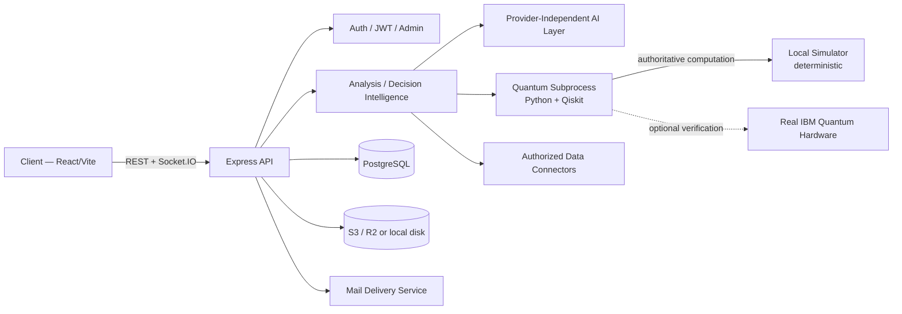

# ANATOLIA-Q

 

**Quantum-Based National Decision Support System**  
Bold Askeri Teknoloji ve Savunma Sanayi A.Ş.

### From artificial intelligence to decision intelligence, from quantum computing to verifiable analysis.

ANATOLIA-Q is a multi-domain national decision-support and analysis platform that brings artificial intelligence, deterministic computation, and quantum technologies together within a single decision architecture.

The platform is designed not merely to generate AI-written reports, but to analyze structured or user-supplied information, evaluate alternative scenarios, support critical calculations through independent computational layers, and preserve a technical trail showing how a decision-support result was produced.

ANATOLIA-Q combines three principal computational capabilities:

- **Provider-independent AI orchestration** — a multi-provider, fallback-capable AI layer for analysis, consultation, and structured reporting. Individual model providers can be changed or extended without redefining the platform architecture.
- **Deterministic and quantum analysis** — scenario probability analysis, QAOA-based resource optimization, and quantum-kernel anomaly analysis provide computational layers independent from generative narrative output.
- **Real quantum hardware verification** — supported quantum workloads can, when configured, be executed through an independent verification lane on real IBM Quantum hardware.

Real NISQ hardware output is not treated as the authoritative decision path. Deterministic local computation remains authoritative while real quantum hardware serves as an independent verification layer.

---

## The ANATOLIA-Q Approach

A conventional generative-AI workflow is commonly reduced to:

**Input → AI model → Text output**

ANATOLIA-Q is designed around a broader decision-support chain:

**Data / User Input → Source & Data Quality → AI Analysis → Deterministic / Quantum Computation → Independent Quantum Verification → Evidence & Decision Trace → Structured Decision-Support Report**

Artificial intelligence is therefore a component of the decision-support architecture, not the decision itself.

Where available, the system retains source provenance, data-quality information, model and prompt-version metadata, computational stages, quantum-backend metadata, evidence, and execution traces so that a later audit can establish how a result was produced.

### Core Technology Layers

| Layer | ANATOLIA-Q capability |
|---|---|
| Artificial Intelligence | Multi-provider, fallback-capable AI orchestration |
| Decision Analysis | Deterministic computation and scenario analysis |
| Quantum Computing | Qiskit-based quantum modules |
| Optimization | QAOA-based resource/portfolio optimization |
| Anomaly Analysis | Quantum-kernel fraud/AML analysis |
| Real Quantum Hardware | IBM Quantum verification lane |
| Decision Intelligence | Provenance, quality, evidence, and decision trace |
| Institutional Integration | Pluggable framework for authorized data sources |
| Reporting | Structured DOCX/PDF decision-support reports |
| Platforms | Web, Windows, Android |

### Current System Status

| Component | Status |
|---|---|
| Web platform | Operational |
| Windows / Electron client | Operational |
| Android / Capacitor client | Operational |
| Multi-provider AI layer | Implemented |
| Deterministic analysis path | Implemented |
| Quantum analysis modules | Implemented |
| IBM Quantum hardware integration | Verified |
| Decision trace / Analysis Audit | Implemented |
| Institutional connector framework | Ready for authorized integrations |
| Live authorized institutional connections | Dependent on institution/API authorization |

> **Verification scope:** successful execution on IBM Quantum hardware establishes that the supported quantum circuit was executed on real hardware. It does not by itself prove the authority of the input data or the correctness of the overall decision-support conclusion.

---

## Research Context

This project sits at the intersection of applied AI, decision intelligence, and near-term quantum computing.

- **AI layer:** provider-independent orchestration with automatic fallback for report generation and consultation workflows.
- **Quantum layer:** scenario probability analysis, QAOA-based resource allocation, and quantum-kernel fraud/AML anomaly detection.
- **Deterministic decision path:** reported decisions come from the deterministic local computation path. Real IBM Quantum hardware, when configured, is used as an independent verification lane so NISQ hardware noise cannot alter the authoritative result.
- **Live IBM Quantum validation:** authentication, Qiskit Runtime service connection, real-backend selection, transpilation, hardware job submission, and result retrieval have been exercised against a real IBM Quantum Platform account through the production integration path.
- **Institutional integration:** the current deployment is not connected to any live bank, telecom, or government system. The data-source layer is intentionally pluggable: authorized institutional APIs, core-banking feeds, BDDK/BTK exports, or other structured sources can be normalized into the existing analysis pipeline without redesigning the core system.
- **Limitations:** successful IBM hardware verification proves that the circuit ran on real hardware; it does not by itself establish that the underlying input data came from an authoritative institutional source.

---

## Features

### AI & Reporting

- **10 Analysis Categories** — Defense, Energy, Offensive, Economy, Social, Consultation, Health, Multi-Domain Synthesis, BDDK, BTK
- **Multi-Provider AI Assurance** — provider-independent orchestration with automatic fallback
- **Fixed-Format Reports** — DOCX/PDF generation, report history, and central-mail delivery
- **Voice Assistant** — transcription, TTS, and natural-language command handling
- **Conversation Memory** — per-user consultation memory and archive
- **Morning Brief** — automated intelligence digest from configured public sources

### Decision Intelligence & Auditability

- **Analysis Orchestrator** — central execution primitives for ingest, validation, normalization, AI/quantum stages, and future institutional connector flows
- **Data Provenance** — records whether analysis input originated from model-generated data, user uploads, manual input, or an authorized institutional source
- **Data Quality Assessment** — assigns an internal quality level and score from available source/record/warning evidence
- **Evidence Chain** — preserves the principal AI, quantum, fraud, optimizer, and source metadata supporting an analysis
- **Decision Trace** — records the analysis execution path and stage timing without requiring the end user to manage internal engines
- **Model Registry** — records the AI provider/model and prompt version associated with analysis execution
- **Scenario Replay & Outcome Tracking** — platform APIs support replaying a recorded decision context and recording subsequent real-world outcomes
- **Analysis Audit View** — archived reports expose a concise audit panel showing provider/model, prompt version, source provenance, data quality, classification, duration, quantum backend metadata, and creation time when those fields are available

These controls are system-level traceability features. Users are not expected to compare classical and quantum engines manually; ANATOLIA-Q presents one decision-support result while retaining the technical audit trail behind it.

### Quantum Computing

- Scenario probability engine
- QAOA-based portfolio/resource optimization
- Quantum-kernel fraud/AML anomaly detector for BDDK/BTK workflows
- Deterministic simulator-first execution
- Optional real IBM Quantum hardware verification for supported modules
- Hardware verification metadata retained through the decision-intelligence layer when available

### Institutional Integration Foundation

- **Pluggable Connector Framework** — common contract for authorized institutional data adapters
- **REST Connector Base** — reusable authenticated REST connector with normalized output contract
- **Connector Health/Status** — registered integrations can expose configuration and health state without changing the downstream analysis pipeline
- No live BDDK, BTK, banking, telecom, or government endpoint is claimed until an authorized institution-specific API specification and credentials are actually configured

### Emergency & Situational Awareness

- Emergency center and user notifications
- Encrypted chat and video-call workflows
- 3D globe/Turkey personnel visualization
- Browser Web Push for supported emergency events

### Administration & Operations

- **Passkey / WebAuthn Login** — optional hardware-backed passkey (FIDO2/WebAuthn) registration and login from the account's Security settings, as an alternative to password login; a passkey login mints a session JWT directly and skips the central-mail approval step non-admin password logins otherwise require
- User management and admin audit log
- History archive with DOCX/PDF access and Analysis Audit metadata
- BDDK/BTK fraud trend endpoint
- Quantum worker/IBM status endpoint
- Platform live/readiness health endpoints
- Operational overview, request metrics, risk overview, connector status, and decision-intelligence endpoints under the versioned platform API

### Appearance

- **Dark Theme** — preserves the original ANATOLIA-Q operational-center appearance
- **Light Theme** — high-contrast light surfaces while retaining cyan/gold identity and HUD structure
- **System Theme** — automatically follows the device light/dark preference
- Theme selection is stored locally and restored on the next session

---

## Architecture



The user-facing analysis path remains simple: **input → analysis → decision-support report**. Internally, ANATOLIA-Q can retain provenance, quality, model, quantum, evidence, and execution-trace metadata so a later audit can establish how the result was produced.

---

## Platform API

The existing application APIs remain available under `/api/*`. Platform-level decision-intelligence and operational capabilities are also exposed through the versioned `/api/v1/platform/*` surface.

These include platform live/readiness checks, connector status, operational/risk overview, request metrics, decision trace lookup, model registry, scenario replay, outcome recording, and retention/classification information.

See **[API.md](./API.md)** for the complete application endpoint inventory and **[openapi.yaml](./openapi.yaml)** for the machine-readable specification of the versioned `/api/v1/platform/*` surface.

---

## Local Development

```bash
npm install --prefix server
npm install --prefix client

# Configure server/.env, then run in separate terminals:
npm run dev:server
npm run dev:client
```

Tests: `npm test --prefix server` and `npm test --prefix client`.

---

## Desktop (Electron — Windows, macOS, Linux)

`desktop/` contains a production Electron shell around the same `client/` React app, adding an offline-first SQLite cache and a bidirectional sync engine against the existing Postgres backend — see **[desktop/README.md](./desktop/README.md)** for the full architecture, sync protocol, local AI design, and packaging instructions. Windows ships a code-signed NSIS installer; macOS (dmg) and Linux (AppImage) build and publish alongside it but are currently unsigned.

```bash
npm install
npx electron-rebuild -f -w better-sqlite3
npm run desktop:dev
npm run dist:win
npm run dist:mac
npm run dist:linux
npm rebuild better-sqlite3
npm run test:desktop
```

The web app is unaffected by any of this — `desktop/` only ever loads the already-built `client/dist`, and the sync API additions (`/api/sync/*`, `/api/devices/*`) are additive endpoints alongside the existing ones.

---

## Android (Capacitor)

`mobile/` contains a Capacitor shell around the same `client/` React app, reusing the desktop app's offline-first sync architecture, device auth, and local AI through Capacitor's asynchronous native APIs. It is distributed as a sideloaded APK, matching the desktop app's closed institutional distribution model.

```bash
cd client && npm run build
cd ../mobile && npm ci
npm run sync
npm run open
cd android && ./gradlew assembleDebug
./gradlew assembleRelease
```

### On-Device Local AI (Android)

When the device has no network connectivity, ANATOLIA-Q can still generate a full analysis report entirely on-device, via a real generative LLM running through `llama.cpp` (native NDK/JNI, `mobile/android/app/src/main/cpp/`) instead of falling back to matching archived reports.

- **Not installed by default.** The model is not bundled with the APK. Before offline generation can work, the user must open **Settings → Local AI** while online and tap **Download** to fetch and verify the model once; it is then stored on-device and reused across sessions.
- **Device-tiered model selection** — the app reads the device's real RAM (`getDeviceInfo`) and picks the richest tier it can run:

  | Tier | Model | Size | Min. RAM | Status |
  |---|---|---|---|---|
  | LOW | Qwen2.5-0.5B-Instruct (Q4_K_M, GGUF) | ~490 MB | 3 GB | Available |
  | MID | Qwen2.5-1.5B-Instruct (Q4_K_M, GGUF) — same model the desktop client pins | ~1.1 GB | 6 GB | Available (default for 6-12 GB devices) |
  | HIGH | Qwen2.5-7B-Instruct (Q4_K_M, GGUF) | ~4.7 GB | 12 GB | Available for 12 GB+ devices — an earlier 3B HIGH tier caused a real-device crash mid-generation; the native generation loop now enforces a wall-clock deadline and a minimum output length, the two safety nets that were missing when that crash happened |

  A device below the LOW floor, or with no RAM signal at all, fails safe into the same archived-report matching used before this feature existed rather than attempting generation.

  Desktop (`desktop/localAI/`) tiers the same way, minus the LOW tier — a real desktop/laptop's realistic floor is already the MID tier's own 4 GB minimum: MID (1.5B) by default, HIGH (7B) automatically on a 12 GB+ machine.
- **Manual tier picker** — Settings → Local AI also lists every pinned tier so the user can override the automatic RAM-based pick; the list is shown whether or not a model is currently installed, so it stays available to switch to a different tier — e.g. after a device or app update changes what fits — at any time, not just before the first install. Selecting a different tier removes the currently installed model first (a different tier is a different file, so nothing is left orphaned on disk), then the newly selected tier is ready to download.
- **Offline device login** follows the same "authorize once online, then works offline" model as desktop: the first login on a given device for a given account must succeed online (it registers the device and caches a locally-verifiable credential); every login after that on that device can succeed fully offline.
- **ÇIKIŞ YAP vs BU CİHAZI UNUT** — sign-out on desktop and mobile is two distinct operations, not one. **ÇIKIŞ YAP** (`logoutSession()`) marks the cached session `signedOut: true` rather than clearing the JWT — the JWT, password hash and this device's offline login authorization are all deliberately preserved, so the app correctly shows the login screen again at next launch while a subsequent offline login still has real cached credentials to verify against and can log the same account back in on this device right away, offline; a successful offline login clears `signedOut` again. **BU CİHAZI UNUT** (`forgetDevice()`, Settings → Security) fully removes this device's offline login credential and authorization and, network permitting, revokes the device server-side (`DELETE /api/devices/:deviceId`); a fresh online login is required before offline login works again on this device. If Offline Mode (below) is on, `forgetDevice()` removes local authorization immediately and keeps an account-correlated revoke tombstone only inside the OS-protected encrypted store. Returning to Otomatik alone never sends an old credential: the next successful online login to the same account uses its fresh JWT to settle the server-side revoke before re-registering. A different account never has its JWT used for the old account's revoke; registering that same physical device safely reassigns the server row to the newly authenticated account.
- **ÇEVRİMDIŞI MOD** — a separate, user-selected app-wide preference (Settings → Bağlantı, `client/src/services/appModePreference.js`), independent of login/device-authorization state above. Switching it on suspends cloud connectivity, live sync, and every online-only service (Socket.IO, the update check, the weather widget, cloud AI routing, passkey management) regardless of whether the machine is actually reachable — local data and the pending sync queue are untouched and continue working normally. On Android this is enforced centrally in `client/src/services/mobileBridge.js`: `checkConnectivity()` and `performSync()` — and everything that funnels through them (analysis create/update/remove, forceSync, conflict resolve, post-login sync, the periodic timers, the update check) — no-op outright while the preference is on, rather than each call site gating itself individually. Switching back to Otomatik reconciles: it reconnects the socket if needed, resumes `checkConnectivity()`/`performSync()`, and (once any pending re-authentication is resolved) flushes the pending sync queue via the existing `forceSync()` primitive. This toggle never touches offline-login authorization or the device's own credential store — those stay governed entirely by ÇIKIŞ YAP/BU CİHAZI UNUT above.
- Generation runs off the UI thread via a Capacitor plugin (`LocalLLMPlugin.kt`) and can take from several seconds to a few minutes depending on the selected tier and device CPU; keep the app in the foreground until it completes.

### Passkey Login (Android)

The bare browser WebAuthn API (`navigator.credentials`) is not reliably usable from a Capacitor WebView, so Android routes Settings → Security's passkey registration/login through a native Capacitor plugin (`PasskeyPlugin.kt`) backed by Android's Jetpack Credential Manager instead. It speaks the same WebAuthn JSON wire format `@simplewebauthn/browser` does, so the server (`routes/webauthn.js`) and every other platform's passkey flow need no changes.

- **Requires `ANDROID_PASSKEY_CERT_FINGERPRINTS`** (see Environment Variables below) to be set server-side. Android verifies this app is authorized to create/use a passkey for the server's WebAuthn RP ID by fetching `/.well-known/assetlinks.json` itself and checking it against the installed app's own signing certificate — with the env var unset, that file 404s and Android refuses every passkey attempt for this app, so the option is effectively non-functional (not merely hidden) until it's configured.
- Get the fingerprint from the actual signing keystore: `keytool -list -v -keystore <path> -alias <alias>`, then copy the `SHA256:` line.
- This is new code and, unlike the rest of Local AI, has not yet been exercised on a real device — verify an actual passkey registration and login on a physical Android device before relying on it.

---

## Environment Variables

### Critical

| Variable | Description |
|---|---|
| `JWT_SECRET` | JWT signing secret; production startup requires a valid configured secret |
| `DATABASE_URL` | PostgreSQL connection string |
| AI provider credentials | At least one configured provider is required for AI analysis; multiple providers enable fallback |

### Application / Infrastructure

| Variable | Description |
|---|---|
| `APP_URL` | Live application URL used by CORS/approval flows |
| `LOG_LEVEL` | pino log level |
| `RESEND_API_KEY` | Enables approval/report email delivery |
| `CENTER_EMAIL` | Central notification/report mailbox |
| `ADMIN_SEED_PASSWORD`, `ADMIN_SEED_USER_CODE`, `ADMIN_SEED_NICKNAME`, `ADMIN_SEED_RESET` | First admin bootstrap account configuration; reset is a one-time recovery switch |
| `SHARED_PASSWORD`, `BOOTSTRAP_USERS_JSON` | Optional non-admin bootstrap accounts; keep real user-code inventories in deployment env, not the repository |
| `REDIS_URL` | Optional Redis-backed active-user/location state |
| `S3_BUCKET`, `S3_ACCESS_KEY_ID`, `S3_SECRET_ACCESS_KEY`, `S3_ENDPOINT`, `S3_REGION` | Optional persistent object storage |
| `SENTRY_DSN` | Optional server error reporting |
| `GITHUB_TOKEN` | Optional read-only PAT; keeps the Android/desktop update check working when this repo is private |
| `VITE_ICE_SERVERS` | Optional client-side TURN/ICE configuration for emergency video |
| `VAPID_PUBLIC_KEY`, `VAPID_PRIVATE_KEY`, `VAPID_SUBJECT` | Optional Web Push configuration |
| `NEWS_RSS_SOURCES` | Optional override for morning-brief sources |
| `CONVERSATION_MEMORY_TTL_DAYS` | Consultation-memory retention window |
| `ANATOLIA_CLOUD_URL` | Desktop-only deployed API/web origin |
| `VITE_MOBILE_CLOUD_URL` | Mobile-only build-time deployed API/web origin |
| `DATABASE_CA_CERT` | PEM CA certificate enabling verified Postgres TLS in production; unset connections stay encrypted but unverified (MITM risk) |
| `DECISION_RETENTION_DAYS` | Retention window (days) for decision-intelligence records; defaults to 365 |
| `FILE_SCAN_WEBHOOK_URL` | Malware/CDR scan webhook for uploaded files; unconfigured leaves scanning a no-op |
| `APPROVED_CLOUD_PROVIDERS` | Comma-separated allowlist narrowing which cloud AI providers may receive INTERNAL/CONFIDENTIAL-classified analysis data; unset allows every configured provider (existing behavior) |
| `UPLOAD_MAX_CONCURRENCY` | Max concurrent file uploads server-wide; defaults to 8 |
| `QUANTUM_MAX_CONCURRENCY` | Max concurrent quantum worker subprocesses; defaults to 4 |
| `QUANTUM_JOB_POLL_MS` | Quantum job-queue poll interval in ms; defaults to 5000 |
| `WEBAUTHN_RP_NAME`, `WEBAUTHN_RP_ID`, `WEBAUTHN_ORIGINS` | Optional passkey/WebAuthn Relying Party overrides; all default from `APP_URL` and only need setting when the public origin differs from it |
| `ANDROID_PASSKEY_CERT_FINGERPRINTS` | Required only for Android passkey login: comma-separated SHA-256 signing certificate fingerprint(s), served at `/.well-known/assetlinks.json` (see the Android section below); unset means the Android passkey option stays hidden/non-functional while every other platform's passkey support and every other login method are unaffected |

### Quantum

| Variable | Description |
|---|---|
| `IBM_QUANTUM_TOKEN` | IBM Cloud API key used by Qiskit Runtime |
| `IBM_QUANTUM_INSTANCE` | IBM Quantum Platform/Qiskit Runtime service-instance CRN |
| `IBM_QUANTUM_WAIT_SECONDS` | Maximum wait for the optional hardware-verification lane; defaults to 60 seconds |
| `PYTHON_BIN` | Optional Python executable override for Qiskit subprocesses |

---

## How It Works

**Login:** credentials are checked against `auth_users`. After successful password validation, admin accounts receive a JWT immediately with a 4-hour lifetime. Non-admin accounts enter the central-mail approval flow: the approval token expires after 10 minutes and, after approval, the client receives a 2-hour JWT. A user who has registered a passkey can instead complete a WebAuthn ceremony, which mints the same-lifetime JWT immediately and skips the approval step.

**Analysis:** the user selects a category and supplies the brief/data → the provider-independent AI layer generates the structured report → supported quantum modules independently recompute relevant scenario, optimization, or anomaly structures → the authoritative local result is merged into the report → optional IBM hardware verification can run as a separate verification lane → the report is persisted and exported.

**Audit:** analysis execution metadata can be recorded by the decision-intelligence layer. When an archived analysis has a matching trace, the History view displays an Analysis Audit panel containing the relevant model, prompt, provenance, quality, classification, duration, and quantum metadata.

**Appearance:** Settings → Appearance provides Dark, Light and System modes. The selected mode is retained in local storage; System mode follows the operating system/browser preference.

---

## Deployment

Production runs on Northflank, which builds the repo's `Dockerfile` and deploys automatically on every push to `main` via its own GitHub integration.

| Workflow | Trigger | Purpose |
|---|---|---|
| `.github/workflows/ci.yml` | Push / pull request | Version/i18n/locale consistency checks; server + client typecheck, lint and tests; quantum Python syntax + worker smoke test; security scans (gitleaks secret scan, npm audit, CycloneDX SBOM); desktop test suite; a branch-gated Elliptic AML benchmark job (`experiment/*` branches only, same purpose as the standalone workflow below) |
| `.github/workflows/codeql.yml` | Push / pull request / weekly schedule | Static analysis (SAST); findings are published as code-scanning alerts |
| `.github/workflows/android-release.yml` | Push to `main` / manual dispatch | Builds the sideload APK and publishes it to GitHub Releases |
| `.github/workflows/android-emulator-test.yml` | Push to `main` / manual dispatch | Informational only, never gates the release pipeline: runs the real on-device instrumented test against an Android emulator, verifying the native `llama.cpp` JNI bridge actually loads a model and generates text, not just that it compiles |
| `.github/workflows/desktop-release.yml` | Push to `main`, `desktop-v*` tag / manual dispatch | Builds Windows/macOS/Linux installers and publishes them to GitHub Releases |
| `.github/workflows/elliptic-benchmark.yml` | Push to experiment branches / manual dispatch | Runs the real Elliptic AML fraud-detection benchmark; not part of the main release pipeline |

A deployment should be treated as live only after CI completes successfully and the Northflank build/deploy finishes.

---

## Security Notes

- Passwords are bcrypt-hashed in `auth_users` (bcrypt cost factor 12)
- Admin JWTs expire after 4 hours; non-admin JWTs issued after central approval expire after 2 hours
- Non-admin approval tokens expire after 10 minutes; approval is performed by POST after an explicit confirmation page
- Blocking a user disconnects the active socket session
- Sensitive credentials belong in environment configuration, never connector source code
- Institutional connectors must not be described as live until authorized endpoint specifications and credentials are configured
- ANATOLIA-Q is a decision-support system; its outputs do not replace authorized institutional or human decision-making
- Security issues should be reported according to **[SECURITY.md](./SECURITY.md)**

---

## Current Capability Summary

ANATOLIA-Q currently combines provider-independent multi-provider AI decision-support reporting, deterministic quantum analysis with optional real IBM hardware verification, decision provenance/quality/evidence/trace foundations, model and prompt audit metadata, an archived-report Analysis Audit UI, scenario replay/outcome APIs, an institutional connector framework, operational/readiness/connector/risk platform APIs, a versioned `/api/v1/platform` interface with OpenAPI specification, emergency communication/situational-awareness features, and persistent Dark/Light/System appearance modes.

The next institution-specific connector should be implemented only when a real authorized API/data specification is available; the platform does not fabricate institution endpoints or claim integrations that have not been configured and tested.

---

## License

Proprietary — see [LICENSE](./LICENSE). All rights reserved; this source is not licensed for copying, modification, or redistribution without the Company's prior written consent.

**© Bold Askeri Teknoloji ve Savunma Sanayi A.Ş.** · All Rights Reserved
