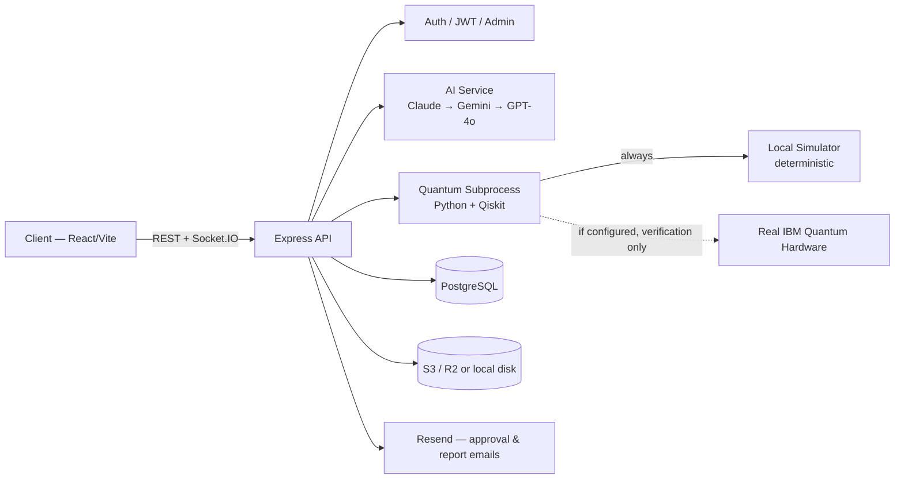

# ANATOLIA-Q

 

**Quantum-Based National Decision Support System**
Bold Askeri Teknoloji ve Savunma Sanayi A.Ş. (Bold Military Technology and Defense Industry Inc.)

ANATOLIA-Q generates structured, fixed-format decision-support reports across 10 domains (defense, energy, economy, health, financial crime, and more), optionally cross-checking the AI's scenario/risk estimates against real quantum circuits — including, when configured, real IBM Quantum hardware — instead of treating "quantum-powered" as a marketing label.

---

## Research Context

This project sits at the intersection of applied AI (LLM-based report generation with a triple-provider fallback chain) and near-term quantum computing (NISQ-era circuits run on both simulators and real superconducting hardware).

- **Motivation:** LLM-generated risk/scenario narratives are fluent but not verifiable — there's no independent check on whether a stated "42% probability" or "flagged as anomalous" means anything beyond the model's confident phrasing. ANATOLIA-Q's quantum modules re-derive those numbers from an explicit, inspectable circuit instead of asking the LLM to also grade its own homework.
- **Approach:** three independent quantum techniques, each matched to what it's actually verifying — amplitude-encoded interference for scenario probability distributions (`scenario_quantum.py`), a QAOA-style combinatorial solver for budget-constrained resource allocation (`portfolio_optimizer.py`), and an exact quantum-kernel fidelity measure for anomaly detection in transaction data (`fraud_detection.py`).
- **Hardware verification, deliberately scoped:** every module's *decision* (the reported probability, the selected allocation, the fraud flag) always comes from a deterministic local simulation. Real IBM Quantum hardware, when configured, is used only as a second, separate measurement — real NISQ hardware noise is not an acceptable source of variance for a number that gets reported as fact or used to flag a financial transaction. See `server/quantum/_ibm_backend.py` and each module's docstring for the reasoning.
- **Use cases:** the four "hard" domains (BDDK/BTK financial-crime detection, defense/energy scenario planning, resource-allocation optimization) are where the quantum layer adds falsifiable structure on top of the LLM narrative. The remaining categories (social, health, multi-domain synthesis, consultation) are LLM-only by design — there's no quantum formulation that adds value there yet.
- **Limitations:** the quantum circuits operate on data the LLM itself extracts from its own generated report (or on user-uploaded real data, when provided) — they are not connected to any live bank, telecom, or government system. A "verified on real IBM hardware" badge means the *circuit* ran on real hardware, not that the underlying financial/scenario data is independently authoritative. NISQ hardware queue times (up to `IBM_QUANTUM_WAIT_SECONDS`, default 60s) make the hardware-verification lane unsuitable for latency-sensitive use.

If you're referencing the quantum methodology specifically in academic or technical writing, see [Citation](#citation) below.

---

## Features

**AI & Reporting**
- **10 Analysis Categories** — Defense, Energy, Offensive, Economy, Social, Consultation, Health, Multi-Domain Synthesis, BDDK, BTK
- **Triple AI Assurance** — Claude (Anthropic) → Gemini → GPT-4o automatic fallback, for both the one-shot report generator and the streaming consultation chat
- **Fixed-Format Report** — auto-generated document number, Times New Roman 11pt, cover page + header/footer, produced as both DOCX and PDF, saved to history, and automatically emailed to the central mailbox as .docx
- **Voice Assistant** — Whisper transcription, TTS playback, and a natural-language voice command intent parser (OpenAI-backed)
- **Conversation Memory** — danışma (consultation) chats can be saved, AI-summarized, archived, and revisited later per user
- **Morning Brief** — a daily auto-generated intelligence digest aggregated from Turkish government/news RSS and HTML sources

**Quantum Computing** (Qiskit, `server/quantum/`)
- Scenario probability engine, QAOA portfolio optimization, and a quantum-kernel fraud/AML anomaly detector for BDDK/BTK
- Every module always runs on a local, deterministic simulator first; when `IBM_QUANTUM_TOKEN`/`IBM_QUANTUM_INSTANCE` are configured, the scenario and fraud modules *additionally* verify one result on real IBM Quantum hardware (a repeat circuit run for scenarios, a swap-test fidelity check for fraud) as a separate, clearly-labeled data point — see [Research Context](#research-context)

**Emergency & Situational Awareness**
- **Emergency Center** — center notification, user notification, end-to-end encrypted chat, and video call panels
- **3D Rotating Globe & Turkey Map** — real-texture Earth map with city pins and radar sweep, plus a dedicated Turkey-focused personnel radar view

**Administration**
- **Admin Panel** — user management (create/update/block/delete), an audit log of admin actions, and a public `/api/analysis/quantum-status` health check that reports whether the Qiskit worker and IBM hardware link are actually working
- **History Archive** — all reports can be viewed, downloaded (DOCX/PDF), and appear in a live activity feed
- **Two-Stage Login** — user code + password, followed by approval via the central mailbox (`info@boldkimya.com.tr`); admin accounts skip mail approval and get a JWT immediately (see [Security Notes](#security-notes))

---

## Architecture



The request path for a quantum-mode report: **User → API → AI (report text) → parse scenario/transaction/optimization tables out of that text → Quantum subprocess (simulator, +optional hardware verification) → merged result appended to the report → DOCX/PDF → DB + email.**

```
anatolia-q/
├── server/                       # Node.js + Express backend (ESM, run via tsx)
│   ├── src/
│   │   ├── index.js              # Main server
│   │   ├── routes/                # API routes — see API.md for the full endpoint list
│   │   ├── services/              # AI (ai.ts), DB, mail, socket, DOCX/PDF, quantum (quantum.js, fraudDetection.js, portfolioOptimizer.js), morningBrief, webResearch, scenarioDataSource, transactionSource
│   │   ├── db/                     # Drizzle schema and client
│   │   ├── lib/                    # Redis/S3 fallbacks, JWT secret, quantum subprocess timeout budgeting, logger
│   │   └── middleware/            # JWT authentication, rate limiting
│   └── quantum/                   # Python/Qiskit scripts (scenario_quantum.py, portfolio_optimizer.py, fraud_detection.py, _ibm_backend.py)
├── client/                        # React + Vite + Tailwind frontend
│   └── src/
│       ├── pages/                 # LoginPage, DashboardPage
│       ├── components/            # Sidebar, 3D globe/Turkey map, analysis, history, memory panel, admin user management, emergency, voice assistant
│       └── services/               # API and socket clients, i18n (Turkish UI strings)
├── render.yaml                    # Render deploy configuration (web service + Postgres)
└── package.json                   # Root scripts
```

This tree covers the directories that matter for understanding the system, not every file — see `API.md` for the exhaustive endpoint list and the source itself for full detail.

---

## Local Development

```bash
# Install dependencies
npm install --prefix server
npm install --prefix client

# Create and fill in server/.env (see Environment Variables)

# Two separate terminals:
npm run dev:server   # backend — http://localhost:10000
npm run dev:client   # frontend — http://localhost:5173
```

Tests: `npm test --prefix server` and `npm test --prefix client`

---

## Environment Variables

**Critical** — the app will not start or will be non-functional without these:

| Variable | Description |
|---|---|
| `JWT_SECRET` | JWT signing secret. Server refuses to start without it (`server/src/lib/jwtSecret.js`) |
| `DATABASE_URL` | PostgreSQL connection string — without it, most features degrade to `isDbConfigured() === false` fallbacks (empty lists, no persistence) |
| At least one of `ANTHROPIC_API_KEY`, `GEMINI_API_KEY`, `OPENAI_API_KEY` | Without any AI provider key, `/generate` and `/chat` fail outright |

**Configured, but fails silently if wrong or missing** — the app keeps running and looks like it succeeded, so these deserve extra care:

| Variable | What actually happens if it's missing |
|---|---|
| `RESEND_API_KEY` | Approval and report emails are **silently skipped** (`sendApprovalEmail`/`sendAnalysisReport` return `{ skipped: true }`) — the login flow still shows "Merkez onayı bekleniyor" (approval pending) as if the email went out. If mail approval isn't working in production, check this first |
| `CENTER_EMAIL` | Falls back to a hardcoded `info@boldkimya.com.tr` if unset — not a hard failure, but silent if you meant to redirect notifications elsewhere |

**Everything else required for normal operation:**

| Variable | Description |
|---|---|
| `APP_URL` | The app's live URL (for CORS and approval links) |
| `LOG_LEVEL` | pino log level (`debug`/`info`/`warn`/`error`) |
| `SHARED_PASSWORD` | One-time seed password for the original hardcoded user list, used only to populate `auth_users` on first boot if the table is empty — not read again afterward |

**Platform-provided** (set by Render itself, or safe to leave at their defaults locally):

| Variable | Description |
|---|---|
| `NODE_ENV` | `production` on Render (`render.yaml`); affects logging and error verbosity |
| `PORT` | The port the server listens on; Render injects this automatically |
| `RENDER_EXTERNAL_URL` | Render's own externally-reachable URL for this service, used by `selfPing.js`'s keep-alive ping |
| `PYTHON_VERSION` | Pinned to `3.11.9` in `render.yaml` — Render's newer default Python has no prebuilt wheel for Qiskit's `symengine` dependency, so pip falls back to compiling it from source, which then fails because the SymEngine C++ library itself isn't installed. Don't bump this without confirming symengine wheels exist for the target version |

**Optional** (if unset, the app keeps working on memory/local-disk fallbacks):

| Variable | What it does |
|---|---|
| `REDIS_URL` | Active user/location state is kept in Redis |
| `S3_BUCKET`, `S3_ACCESS_KEY_ID`, `S3_SECRET_ACCESS_KEY`, `S3_ENDPOINT`, `S3_REGION` | File uploads are stored persistently in S3/Cloudflare R2 |
| `SENTRY_DSN` | Server errors are reported to Sentry |
| `VITE_ICE_SERVERS` | TURN server for the emergency video call feature |
| `IBM_QUANTUM_TOKEN`, `IBM_QUANTUM_INSTANCE`, `IBM_QUANTUM_WAIT_SECONDS` | Run the scenario and fraud-detection quantum modules' verification lane on real IBM Quantum hardware (falls back to simulator-only otherwise); wait defaults to 60s |
| `NEWS_RSS_SOURCES` | Overrides the default RSS/HTML source list the morning brief aggregates from |
| `PYTHON_BIN` | Overrides the `python3` binary used to spawn the Qiskit subprocesses (for local dev setups with a non-default interpreter) |

---

## How It Works

**Login flow:** user code + password are validated against `auth_users` (bcrypt-hashed) → **admin accounts** get a JWT immediately, no approval step. **Non-admin accounts** go through mail approval: a 10-minute approval token is generated → an approve/reject email goes to the central mailbox → the client polls status every 2.5 seconds → once approved, a JWT is issued and login completes.

**Analysis generation:** the user picks a category and writes a brief → system/user prompts are prepared → sent to Claude (falls back to Gemini, then GPT-4o, on quota/error — the same fallback chain also covers the streaming consultation chat) → a markdown report comes back → if quantum mode is on, the report's scenario/transaction/optimization tables are parsed out and recomputed on a real Qiskit circuit (see [Research Context](#research-context)) → converted into the fixed DOCX/PDF templates → saved to the database → automatically emailed to the central mailbox as a .docx attachment.

See **[API.md](./API.md)** for the full list of endpoints and what each one does.

---

## Deployment

The app is deployed on Render via the `render.yaml` blueprint in this repo.

| Workflow | Trigger | Purpose |
|---|---|---|
| `.github/workflows/ci.yml` | Every push, every PR | Typecheck, lint, test (server + client), plus a Python syntax check on all four quantum scripts |
| `.github/workflows/deploy.yml` | `workflow_run`, only after `CI` completes successfully on `main` | Deploys to Render — **not** a direct push trigger, so a push that fails lint/tests never reaches Render |
| `.github/workflows/keep-alive.yml` | Cron, every 10 minutes | Pings `/api/health` so the free-tier instance doesn't spin down from inactivity |

Deploy typically lands a few minutes after the push; check both `CI` and `Deploy to Render` workflow runs on GitHub Actions before assuming a push is live — a low `/api/health` uptime alone isn't proof (a free-tier restart can happen for unrelated reasons). `server/src/services/selfPing.js` runs the same keep-alive idea from inside the app itself, as a second line of defense alongside the GitHub Actions cron.

---

## Performance

Single live samples against the production deployment (Render free tier, Frankfurt region), taken 2026-08-06 — not averages, and free-tier cold-start/neighbor-noise variance is real. Treat as a rough order of magnitude, not an SLA.

| Endpoint | Observed | Notes |
|---|---|---|
| `GET /api/health` | ~0.4s | No DB/auth involved |
| `GET /api/history/list` (auth) | ~0.9–1.5s | DB query, up to 100 rows |
| `GET /api/weather/current` | ~1.1–1.6s | Proxies an external API (Open-Meteo) |
| `GET /api/history/morning-brief/today` | ~0.5s | Pre-generated, served from DB |
| `GET /api/analysis/quantum-status` | ~50s | Spawns a real Qiskit subprocess and attempts a real IBM hardware round-trip; dominated by the hardware queue wait, not local computation |
| `POST /api/analysis/generate` (quantum mode) | tens of seconds to several minutes | Highly variable — depends on which AI provider succeeds, whether quantum mode triggers an IBM hardware verification, and IBM's queue depth (bounded by `IBM_QUANTUM_WAIT_SECONDS`) |

---

## Security Notes

- Passwords are bcrypt-hashed in the `auth_users` table, not stored in plain text. `SHARED_PASSWORD` is only used once, to seed the original hardcoded user list into the database on first boot (if `auth_users` is empty) — it is never read again afterward
- JWTs are short-lived: 4 hours for admin logins, 2 hours for mail-approved user logins
- **Admin logins bypass mail approval entirely** — a correct user code + password for an admin account returns a JWT directly, with no human-in-the-loop step. Treat admin credentials accordingly
- The approval token (non-admin login) is valid for 10 minutes and becomes invalid once used
- Blocking a user (`/api/auth/admin/users/:userCode` with `blocked: true`) force-disconnects their active socket session immediately, rather than waiting for their JWT to expire
- All notifications go to the `CENTER_EMAIL` address — see the Environment Variables table above for what happens if `RESEND_API_KEY` isn't configured
- Found a vulnerability? See [SECURITY.md](./SECURITY.md) — please don't open a public issue for it

---

## Roadmap

**Shipped:**
- ✅ Triple-AI fallback for report generation and consultation chat
- ✅ Quantum scenario probability, QAOA portfolio optimization, and fraud/AML kernel detection
- ✅ Real IBM Quantum hardware verification (scenario + fraud modules)
- ✅ Voice assistant (transcription, TTS, intent parsing)
- ✅ Conversation memory, morning brief, admin panel with audit log

**Under consideration** (not committed — flagged as real gaps found during testing, not a promised timeline):
- ⬜ Admin login 2FA — currently the highest-privilege account has the *weakest* login flow (password only, no mail approval)
- ⬜ An AI-provider quota/usage dashboard for admins, so provider exhaustion is visible before users start seeing failures
- ⬜ Moving long-running quantum jobs (especially IBM hardware verification, which can take the full `IBM_QUANTUM_WAIT_SECONDS`) off the request/response cycle and into a background-job + poll/webhook pattern
- ⬜ A trend view over historical BDDK/BTK fraud flags, rather than each report standing alone
- ⬜ Web Push for emergency notifications, so a closed browser tab doesn't mean a missed alert
- ⬜ A retention/TTL policy for `conversationMemory`, matching the one file uploads already have

---

## FAQ

**Why did my quantum-mode report take minutes instead of seconds?**
Quantum mode always runs a local simulator (fast), but if `IBM_QUANTUM_TOKEN`/`IBM_QUANTUM_INSTANCE` are configured, it *also* attempts a real hardware verification run, which waits on IBM's job queue for up to `IBM_QUANTUM_WAIT_SECONDS` (default 60s) before giving up and falling back. See [Performance](#performance).

**The report generator returned "Tüm AI sağlayıcılar başarısız" (all AI providers failed) — is the app broken?**
Not necessarily the app itself — this means Claude, Gemini, and GPT-4o all failed for that request (commonly: exhausted API quota/credit on all three simultaneously). Check `GET /api/analysis/status` for which providers have keys configured, and each provider's own dashboard for quota/billing status.

**A user says they never got the login approval email — what do I check?**
First: is `RESEND_API_KEY` actually set? If it's missing, the server silently reports success without sending anything (see [Environment Variables](#environment-variables)). If it is set, check `CENTER_EMAIL` and the Resend dashboard for delivery failures.

**Why does `/api/analysis/quantum-status` say `ok: true` but `hardwareVerification: null`?**
`ok: true` only means the local simulator worked — that's always attempted and is the deterministic source of truth. `hardwareVerification: null` with a populated `ibmDiagnostic` string tells you *why* the hardware attempt didn't produce a result (not configured, bad credentials, queue timeout, etc.).

**Can I trust the BDDK/BTK "flagged" decision if IBM hardware verification failed?**
Yes — the flagged/riskScore decision never depends on the hardware verification lane succeeding. It's computed from an exact, deterministic local simulation every time; hardware verification (when it runs) is an independent secondary check, not an input to the decision. See [Research Context](#research-context).

---

## Troubleshooting

| Symptom | Likely cause | Check |
|---|---|---|
| Deploy doesn't seem to reflect a recent push | CI hasn't finished, or failed | GitHub Actions → `CI` workflow run for that commit must be green before `Deploy to Render` even starts |
| Quantum mode always falls back to AI-only estimates | Qiskit/Python worker broken, or the AI's report didn't include a parseable scenario/transaction table | `GET /api/analysis/quantum-status` for worker health; check `quantumWarning` in the `/generate` response for the specific reason |
| `pip install` fails during Render build with a symengine/wheel error | `PYTHON_VERSION` env var got removed or changed | Must stay pinned to a version with prebuilt Qiskit symengine wheels (currently `3.11.9`) — see the Environment Variables table |
| Login approval email never arrives, but the API reports success | `RESEND_API_KEY` not configured | See the FAQ entry above |
| A file upload works locally but 404s on the deployed app | S3/R2 env vars set locally but not on Render (or vice versa) — disk-mode uploads aren't portable across restarts | Confirm `S3_BUCKET` etc. are consistently configured for the target environment |
| IBM hardware verification always reports `configured but failed` | Bad token/CRN, or no available (non-simulator) backend | The `ibmDiagnostic` field carries the actual exception message from `qiskit-ibm-runtime` — check it directly rather than guessing |

---

## Contributing

See [CONTRIBUTING.md](./CONTRIBUTING.md) for setup, testing expectations, and code style. Security issues should go to [SECURITY.md](./SECURITY.md)'s reporting process instead of a public issue.

---

## Citation

If you use or reference ANATOLIA-Q's quantum verification methodology (the scenario-probability circuit, the QAOA portfolio optimizer, or the quantum-kernel fraud detector), please cite:

```bibtex
@software{anatoliaq2026,
  title        = {ANATOLIA-Q: A Quantum-Verified National Decision Support System},
  author       = {{Bold Askeri Teknoloji ve Savunma Sanayi A.Ş.}},
  year         = {2026},
  url          = {https://github.com/atabeyler/anatolia.bold.q},
  note         = {LLM-generated scenario, resource-allocation, and financial-anomaly analysis, cross-checked against deterministic quantum-circuit simulation with optional real IBM Quantum hardware verification}
}
```

---

## Changelog

See [CHANGELOG.md](./CHANGELOG.md) for the history of notable changes.

---

## License

Proprietary — see [LICENSE](./LICENSE). All rights reserved; this source is not licensed for copying, modification, or redistribution without the Company's prior written consent.

**© Bold Askeri Teknoloji ve Savunma Sanayi A.Ş.** (Bold Military Technology and Defense Industry Inc.) · Tüm Hakları Saklıdır
